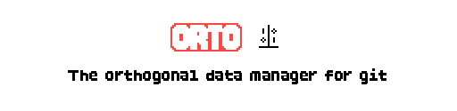

# Orto

**Orto** is an orthogonal data manager for Git.  

It provides a clean and independent layer for managing data alongside your Git repositories, keeping your workflows modular and uncluttered.

# What? Why?

Unlike `git stash`, which keeps temporary changes inside the .git internals, Orto acts as a **safe stash**. It lets you save a snapshot of your uncommitted changes outside of the repository, manage them orthogonally, and bring them back when you need them. This keeps your repository history and stash list uncluttered while giving you fine-grained control over your work-in-progress.

## Planned Features

- Written in Go for speed and portability
- Orthogonal design: manage data without polluting your Git history  
- Lightweight integration with existing Git workflows  
- Several output options (zip, tar.bz2, raw directories, patch, separate git repo, etc.)
- Include files that git ignores
- Encryption to safely store untracked files with credentials
- Simple setup and usage
- Cloning files rather than copying them when supported (e.g., APFS, Btrfs.) Thanks
  [Chris Hulbert](https://www.splinter.com.au) for the idea!

## Current progress - TODO List

- **Startup**
  - Implement CLI
  - Implement error and help screen
  - Add symlink support: symlinks appear as blobs but with a different mode. Also check symlinks on the filesystem.
  - Configuration file?
  - Allow relative directories in the input

- **Find phase**
  - Decide what to do with empty dirs
  - Support arbitrary commits
  - More ignore/include file option

- **Compare phase**
  - Consider using inodes/etc to check if a file is the same / deduplicate hard links

- **Write phase**
  - Save diffs - localized and with full content per file, single file per change set
  - Implement output file compression
  - Separate outputs for index and working tree, etc
  - Where the OS and filesystem allows it, clone files rather than copying them:
  - Stop before running out of space
  - Encryption

- **Testing**
  - Test in Windows and Linux
  - More automated tests
  - Git-based test suite
  - Determine minimum git and go versions
  - Test files with unicode and other special characters

- **Overall**
  - Figure out if there's been a case change, think about how to handle it in different OSs/file systems.
  - Process and include staged (index) changes
  - Save remote, branch and commit info (i.e., where the information came from)
  - Allow find/compare/write to stream rather than executing in sequence.
  - Error recovery where it makes sense
  - Test unmerged files
  - Set up CI pipeline
  - Set up automatic linter and formatter
  - Restore phase

- **Questions**
  - Interactive mode?
  - Consider separating the phases into independent programs
  - Allow output to non-empty directory?
  - Allow output to a parent or child directory in some cases?

- **Technical information**
  - File cloning 
    - [Is it possible to clone directories in APFS? - Ask Different](https://apple.stackexchange.com/questions/322036/is-it-possible-to-clone-directories-in-apfs)
    - [BSD clonefile(2)](https://www.manpagez.com/man/2/clonefile/)
    - [CloneFile call](https://github.com/christian-korneck/macos-clonefile/tree/main)
    - [Efficient data/file copying on modern Linux](https://cfengine.com/blog/2024/efficient-data-copying-on-modern-linux/)
    - [Go Proposal: os: add Copy](https://github.com/golang/go/issues/56172)
    - [Go Renameio package](https://pkg.go.dev/github.com/google/renameio#section-readme)
    - [ioctl_ficlonerange, ioctl_ficlone - share some the data of one file with another file](https://man7.org/linux/man-pages/man2/ioctl_ficlonerange.2.html)
